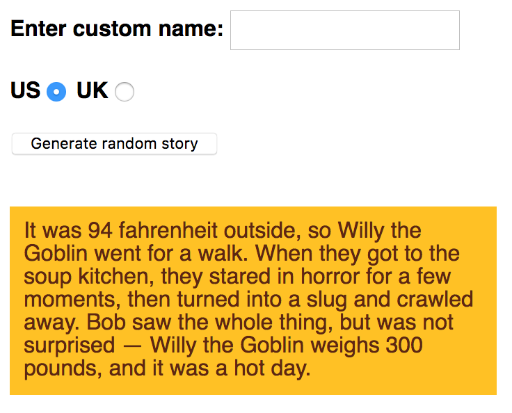

# TP02 - Silly Story Generator

Vous trouverez dans votre repository :

* Un fichier HTML
* Un fichier texte (raw-text.txt) contenant des éléments nécessaires à la résolution de l'exercice.

Suivez les étapes ci-dessous pour obtenir un résultat qui ressemble à ceci.



## Étapes à suivre

Les sections suivantes décrivent ce que vous devez faire.

### Configuration de base

1. Créez un nouveau fichier appelé main.js, dans le même répertoire que votre fichier index.html.
2. Appliquez le fichier JavaScript externe à votre HTML en insérant un élément `<script>` dans votre HTML qui référence `main.js`. Mettez-le juste avant la balise de fermeture `</head>`.

### Variables et fonctions initiales

1. Dans le fichier texte brut, copiez tout le code sous le titre "1. COMPLETE VARIABLE AND FUNCTION DEFINITIONS" et collez-le dans le haut du fichier main.js. Cela vous donne trois variables qui stockent les références au champ de texte "Enter custom name" (`customName`), au bouton "Generate random story" (`randomize`), et à l'élément `<p>` en bas du body HTML dans lequel l'histoire sera copiée (`story`). En outre, vous disposez d'une fonction appelée `randomValueFromArray()` qui prend un tableau et renvoie un des éléments stockés dans le tableau au hasard.
2. Regardez maintenant la deuxième section du fichier texte brut - "2. RAW TEXT STRINGS". Elle contient des chaînes de texte qui serviront de données d'entrée dans notre programme. Nous aimerions que vous les placiez dans le fichier `main.js` :
    1. Stockez la première, grande et longue, chaîne de texte dans une variable appelée `storyText`.
    2. Stockez le premier ensemble de trois chaînes de caractères dans un tableau appelé `insertX`.
    3. Stockez le deuxième ensemble de trois chaînes de caractères dans un tableau appelé `insertY`.
    4. Stocke le troisième ensemble de trois chaînes de caractères dans un tableau appelé `insertZ`.

### Placer le gestionnaire d'événements et la fonction incomplète

1. Retournez maintenant au fichier texte brut.
2. Copiez le code qui se trouve sous le titre "3. EVENT LISTENER AND PARTIAL FUNCTION DEFINITION" et collez-le au bas de votre fichier main.js. Ceci :
    * Ajoute un auditeur d'événement de clic à la variable `randomize` de sorte que lorsque le bouton qu'il représente est cliqué, la fonction `result()` est exécutée.
    * Ajoute une définition de la fonction `result()` partiellement complétée à votre code. Pour le reste de l'exercice, vous devrez remplir des lignes à l'intérieur de cette fonction pour la compléter et la faire fonctionner correctement.

### Compléter la fonction `result()`

1. Créez une nouvelle variable appelée `newStory`, et donnez-lui la valeur de `storyText`. Ceci est nécessaire pour que nous puissions créer une nouvelle histoire aléatoire à chaque fois que le bouton est pressé et que la fonction est exécutée. Si nous apportions des modifications directement à `storyText`, nous ne pourrions générer une nouvelle histoire qu'une seule fois.
2. Créez trois nouvelles variables appelées `xItem`, `yItem` et `zItem`, et rendez-les égales au résultat de l'appel de `randomValueFromArray()` sur vos trois tableaux (le résultat dans chaque cas sera un élément aléatoire de chaque tableau sur lequel il est appelé). Par exemple, vous pouvez appeler la fonction et lui faire renvoyer une chaîne aléatoire de `insertX` en écrivant `randomValueFromArray(insertX)`.
3. Ensuite, nous voulons remplacer les trois caractères de remplissage de la chaîne `newStory` - `:insertx:`, `:inserty:`, et `:insertz:` - par les chaînes stockées dans `xItem`, `yItem` et `zItem`. Il existe une méthode de chaîne de caractère particulière qui vous aidera ici - dans chaque cas, faites l'appel à la méthode égal à `newStory`, ainsi chaque fois qu'il est appelé, `newStory` est rendu égal à lui-même, mais avec des substitutions faites. Ainsi, à chaque fois que le bouton est pressé, ces substitutions sont chacune remplacées par une chaîne de caractères stupide et aléatoire. De plus, la méthode en question ne remplace que la première instance de la sous-chaîne qu'elle trouve, vous devrez donc peut-être effectuer un des appels deux fois.
4. Dans le premier bloc `if`, ajoutez un autre appel de méthode de remplacement de chaîne pour remplacer le nom "Bob" trouvé dans la chaîne `newStory` par la variable `name`. Dans ce bloc, nous disons : "Si une valeur a été saisie dans le champs texte `customName`, remplacez Bob dans l'histoire par ce nom personnalisé".
5. Dans le deuxième bloc `if`, nous vérifions si le bouton radio "UK" a été sélectionné. Si c'est le cas, nous voulons convertir les valeurs de poids et de température dans l'histoire de livres et de Fahrenheit en pierres et en centigrade. Voici ce que vous devez faire :
    1. Cherchez les formules de conversion des livres en pierres et des degrés Fahrenheit en degrés centigrades.
    2. À l'intérieur de la ligne qui définit la variable `weight`, remplacez 300 par un calcul qui convertit 300 livres en pierres. Concaténez " stone" à la fin du résultat de l'appel global `Math.round()`.
    3. A l'intérieur de la ligne qui définit la variable `temperature`, remplacez 94 par un calcul qui convertit 94 Fahrenheit en centigrade. Concaténer " centigrade" à la fin du résultat de l'appel global `Math.round()`.
    4. Juste sous les deux définitions de variables, ajoutez deux autres lignes de remplacement de chaîne qui remplacent "94 Fahrenheit" par le contenu de la variable `temperature`, et "300 pounds" par le contenu de la variable `weight`.
6. Enfin, à l'avant-dernière ligne de la fonction, faites en sorte que la propriété `textContent` de la variable `story` (qui fait référence au paragraphe) soit égale à `newStory`.

## Trucs et astuces

* Vous n'avez pas besoin de modifier le HTML, sauf pour appliquer le JavaScript à votre HTML.
* Si vous n'êtes pas sûr que le JavaScript soit correctement appliqué à votre HTML, essayez de supprimer temporairement tout le reste du fichier JavaScript, en ajoutant un simple morceau de JavaScript dont vous savez qu'il créera un effet évident, puis enregistrez. Par exemple, l'arrière-plan de l'élément `<html>` devient rouge - toute la fenêtre du navigateur devrait donc devenir rouge si le JavaScript est correctement appliqué :

    ```javascript
    document.querySelector('html').style.backgroundColor = 'red';
    ```

* `Math.round()` est une méthode JavaScript intégrée qui arrondit simplement le résultat d'un calcul au nombre entier le plus proche.
* Il existe trois cas de chaînes de caractères qui doivent être remplacées. Vous pouvez répéter la méthode `replace()` plusieurs fois, ou vous pouvez utiliser des expressions régulières. Par exemple,

    ```javascript
    let text = 'I am the biggest lover, I love my love';
    text.replace(/love/g,'like');
    ```

    remplacera toutes les occurrences de 'love' par 'like'. N'oubliez pas que les chaines de caractères sont immuables !
